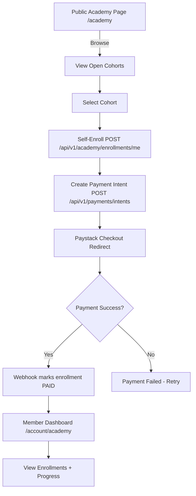
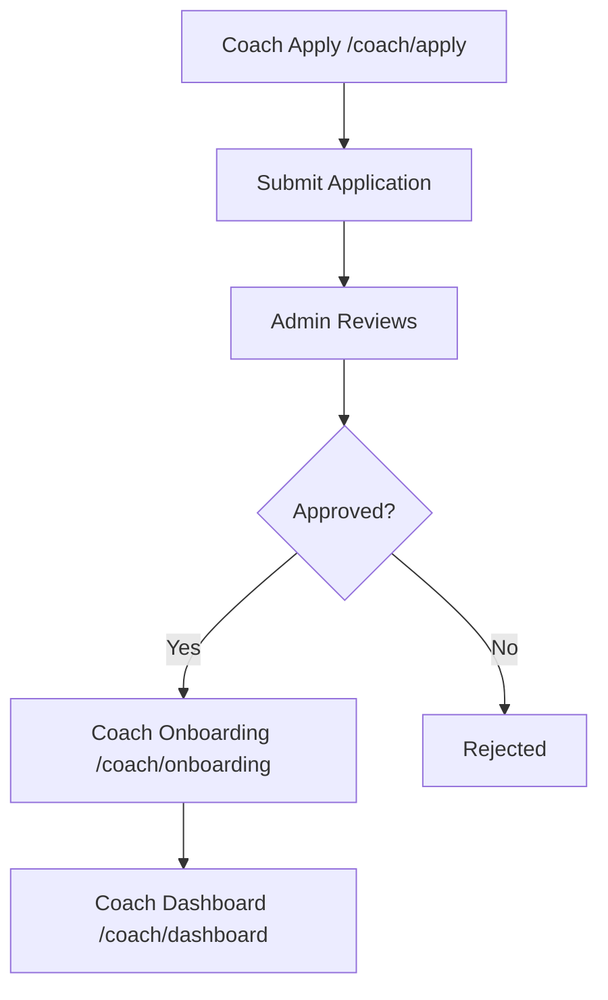
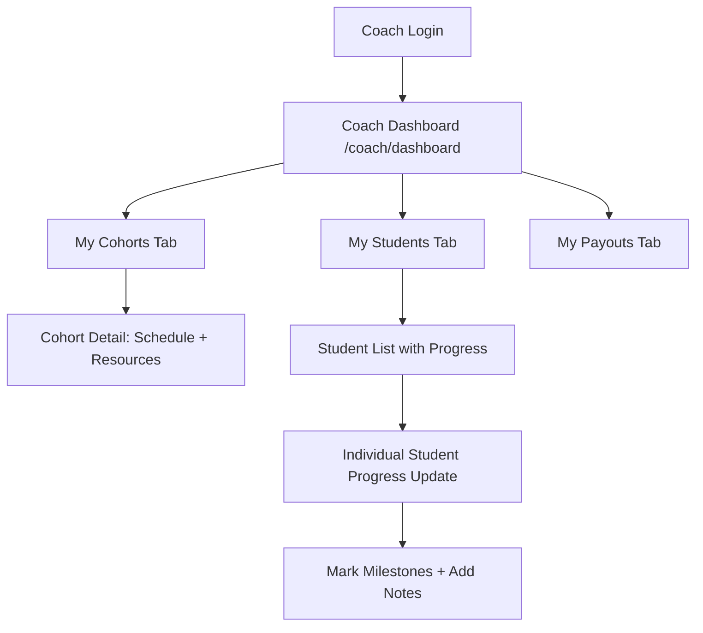
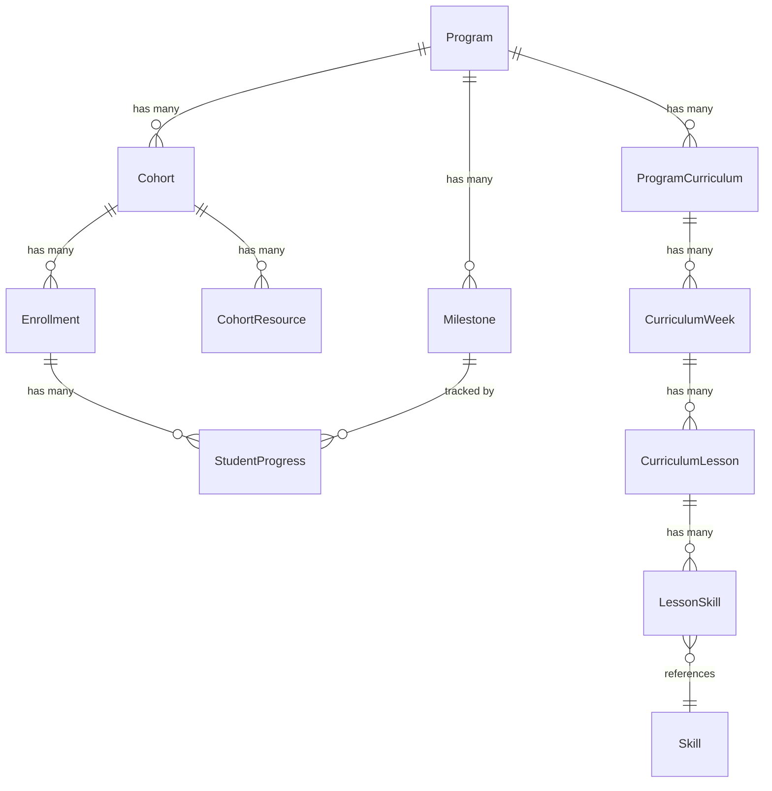
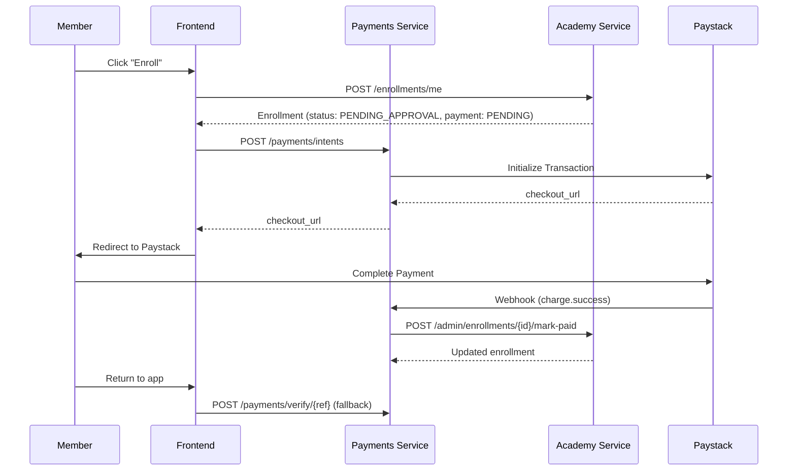
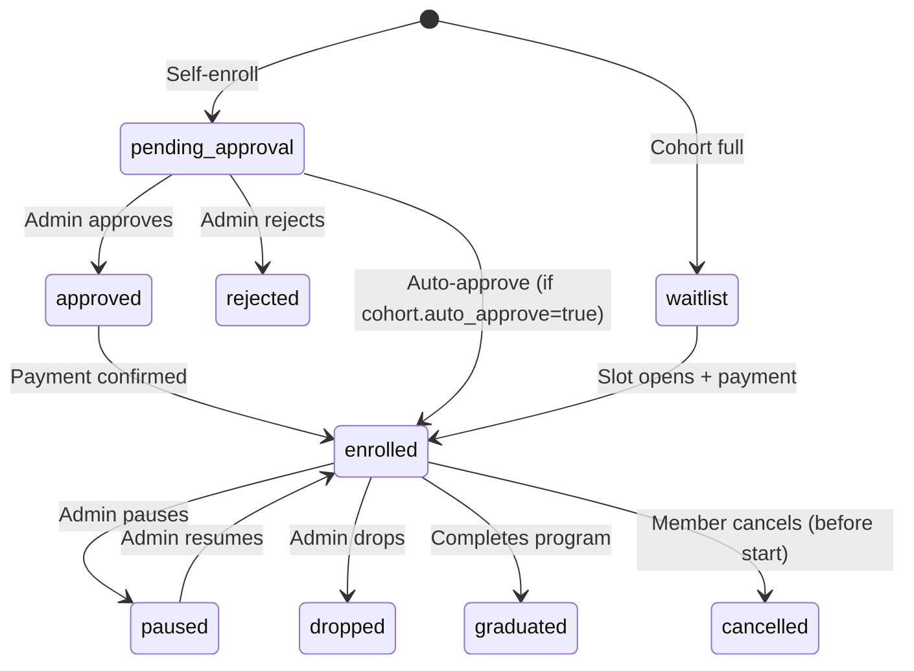
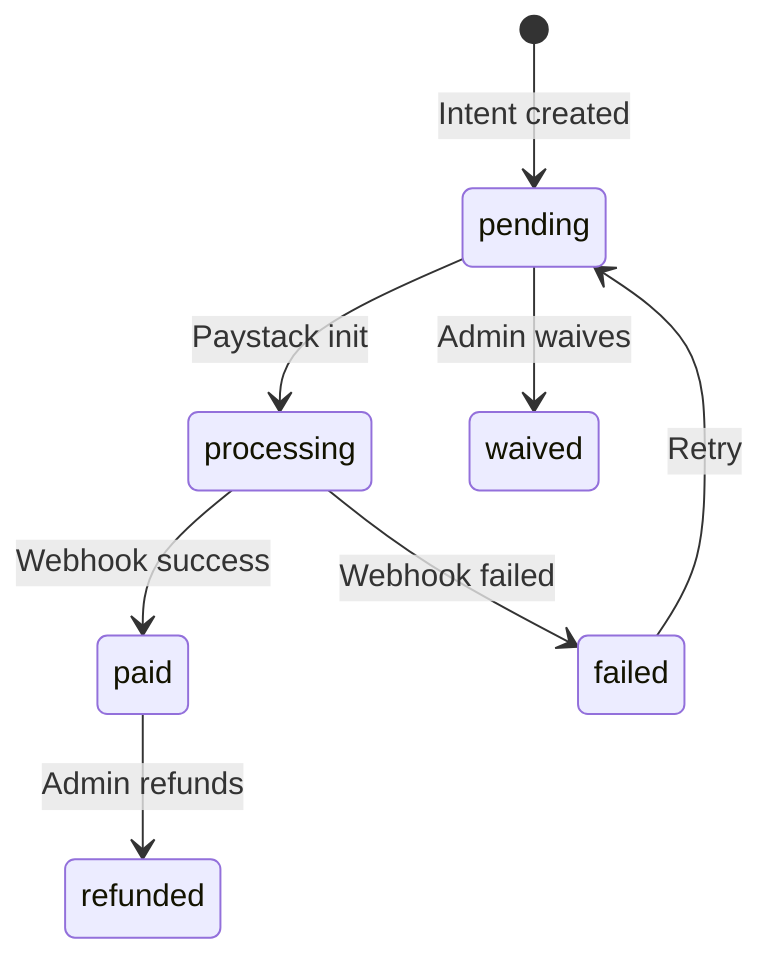
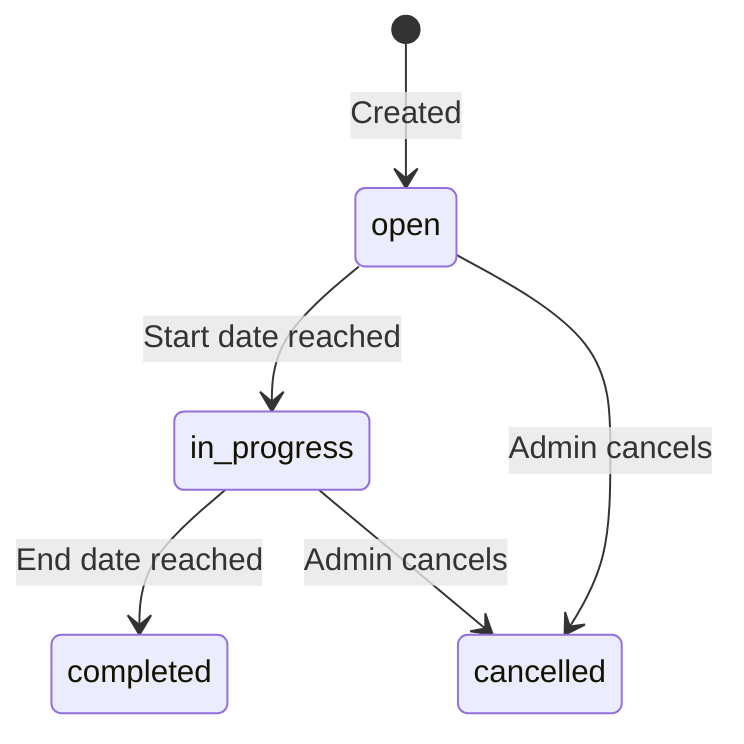

# SwimBuddz Academy Feature Review

## Executive Summary

This document provides a comprehensive end-to-end review of the Academy feature in SwimBuddz, covering Member, Coach, and Admin perspectives. The review identifies gaps, friction points, and provides actionable recommendations for production readiness.

---

## SECTION A — USER FLOWS & UX AUDIT

### Member Perspective

#### Current Flow (As Implemented)



| Screen/Route | API Endpoints | Purpose |
|--------------|---------------|---------|
| `/academy` (public) | None (static) | Landing page with benefits, pathways |
| `/account/academy` | `GET /api/v1/academy/my-enrollments`, `GET /api/v1/academy/cohorts/open`, `GET /api/v1/academy/programs/{id}`, `GET /api/v1/academy/enrollments/{id}/progress` | View enrollments, browse cohorts |
| Self-enroll flow | `POST /api/v1/academy/enrollments/me`, `POST /api/v1/payments/intents` | Request enrollment + payment |

#### Friction Points & Issues

1. **No Dedicated Browse Page**: Member dashboard combines "My Enrollments" and "Available Cohorts" on one page. No dedicated `/academy/programs` browse route exists.

2. **Missing Cohort Detail Page**: Members cannot see cohort details (schedule, coach info, curriculum preview) before enrolling. They jump straight from card to enrollment.

3. **Status Ambiguity After Enrollment**: When `selfEnroll` creates enrollment with `PENDING_APPROVAL` status, the UI doesn't clearly explain what happens next. The payment intent is created immediately, but enrollment may still need admin approval.

4. **Dead End: Payment Pending After Webhook Delay**: If Paystack webhook is delayed, member sees old `payment_status: pending` even after paying. No manual verification button exists on member side.

5. **No "View Details" for Already Enrolled Cohorts**: Based on conversation history, this was addressed but needs verification.

6. **Missing Onboarding Flow**: After enrollment confirmation, there's no guided onboarding explaining how to access resources, sessions, or track progress.

7. **Empty States Are Generic**: "No open cohorts available" message doesn't provide next steps (e.g., "Want to be notified when new cohorts open?").

#### Proposed Improved Flow

```mermaid
graph TD
    A[Public Academy Page] --> B[Browse Programs /member/academy/browse]
    B --> C[Program Detail Page /member/academy/programs/:id]
    C --> D[View Cohorts for Program]
    D --> E[Cohort Detail Modal/Page]
    E --> F{Already Enrolled?}
    F -->|Yes| G[Show "View Enrollment" CTA]
    F -->|No| H[Show "Enroll Now" CTA]
    H --> I[Enrollment Wizard: Review → Pay → Confirmation]
    I --> J[Paystack Checkout]
    J --> K[Success Page with Next Steps]
    K --> L[My Academy Dashboard]
```

**Key Changes:**
- Add dedicated `/member/academy/browse` page with filters
- Add `/member/academy/programs/:id` program detail page
- Add cohort detail modal with coach bio, schedule preview, curriculum overview
- Implement enrollment wizard (stepper)
- Add post-enrollment onboarding checklist

---

### Coach Perspective

#### Current Flow (As Implemented)



| Screen/Route | API Endpoints | Purpose |
|--------------|---------------|---------|
| `/coach/apply` | Coach application flow | Submit coach application |
| `/coach/onboarding` | Unknown | Post-approval setup |
| `/coach/dashboard` | **EMPTY - NOT IMPLEMENTED** | Should show assigned cohorts |

#### Friction Points & Issues

1. **Coach Dashboard Not Implemented**: The `/coach/dashboard` directory is empty. Coaches have no way to:
   - View assigned cohorts
   - See enrolled students
   - Update student progress
   - Access session schedules
   - View payout information

2. **No "Coach" Role in Auth Layer**: The `require_admin` dependency is used for progress updates, but there's no `require_coach` dependency. Coaches cannot update progress without admin privileges.

3. **Cohort Coach Assignment Is Just a UUID**: `Cohort.coach_id` references a Member ID, but there's no validation that this member has an approved CoachProfile.

4. **No Dedicated Coach API Endpoints**: The academy router uses `require_admin` for most write operations. Coaches need:
   - `GET /api/v1/academy/cohorts/coach/me` (exists ✓)
   - `PUT /api/v1/academy/progress` for their cohorts (currently requires admin)
   - `GET /api/v1/academy/cohorts/{id}/students` for their cohorts (currently requires admin)

5. **No Coach Notes/Feedback Workflow**: While `StudentProgress.coach_notes` field exists, there's no dedicated notes interface.

6. **No Payout Visibility**: `CoachProfile.academy_cohort_stipend` exists but coaches can't see their pending/completed payouts.

#### Proposed Improved Flow



**Key Changes:**
- Build coach dashboard with cohort/student/payout tabs
- Create `require_coach` auth dependency
- Add coach-specific endpoints for their cohorts
- Build student progress management UI
- Add coach notes/feedback workflow

---

### Admin Perspective

#### Current Flow (As Implemented)

| Screen/Route | API Endpoints | Purpose |
|--------------|---------------|---------|
| `/admin/academy` | Overview page | Academy admin landing |
| `/admin/academy/programs` | `GET /api/v1/academy/programs` | List programs |
| `/admin/academy/programs/new` | `POST /api/v1/academy/programs` | Create program |
| `/admin/academy/programs/:id` | `GET/PUT/DELETE /api/v1/academy/programs/:id` | Manage program |
| `/admin/academy/cohorts` | `GET /api/v1/academy/cohorts` | List cohorts |
| `/admin/academy/cohorts/new` | `POST /api/v1/academy/cohorts` | Create cohort |
| `/admin/academy/cohorts/:id` | `GET/PUT/DELETE /api/v1/academy/cohorts/:id` | Manage cohort |
| `/admin/academy/enrollments` | `GET /api/v1/academy/enrollments` | List/filter enrollments |
| `/admin/academy/enrollments/:id` | `PATCH /api/v1/academy/enrollments/:id` | Approve/manage enrollment |

#### Friction Points & Issues

1. **No Curriculum Builder Integration**: While `ProgramCurriculum`, `CurriculumWeek`, `CurriculumLesson`, `Skill` models exist, the admin program creation doesn't show curriculum builder prominently. Based on conversation history, there were issues with the curriculum builder UX.

2. **Enrollment Management Is Basic**: Admin enrollments page shows a table but:
   - No inline approval buttons (must click "Manage" → detail page)
   - No bulk approval action
   - Cannot assign cohort and approve in one action

3. **No Session Scheduling for Cohorts**: Sessions service has `cohort_id` but admin cannot schedule sessions from cohort management page.

4. **No Capacity Enforcement**: `Cohort.capacity` exists but enrollment doesn't check/enforce capacity limits.

5. **No Waitlist Management**: `EnrollmentStatus.WAITLIST` exists but no UI to manage or auto-promote from waitlist.

6. **Missing Analytics/Reports**: No cohort completion rates, revenue reports, progress analytics.

7. **Coach Assignment UX**: Must know coach's Member UUID to assign. No picker/search.

#### Proposed Improved Flow

- Add curriculum builder link/wizard during program creation
- Add inline actions on enrollments table (Approve, Reject, Assign Cohort)
- Add "Schedule Sessions" button on cohort detail page
- Implement capacity checking with waitlist auto-promotion
- Add analytics dashboard for Academy metrics

---

## SECTION B — UI/UX IMPROVEMENTS (ACTIONABLE)

### Navigation Improvements

| Current | Proposed | Rationale |
|---------|----------|-----------|
| `/account/academy` shows everything | Split into `/member/academy/browse` and `/member/academy/enrollments` | Separation of concerns, cleaner UX |
| No sub-navigation in Academy | Add tabs: "Browse Programs", "My Enrollments", "My Progress" | Better discoverability |
| Admin Academy has separate pages | Keep but add quick stats cards on overview page | Faster admin workflows |

### CTAs & Labels

| Screen | Current CTA | Proposed CTA | Rationale |
|--------|-------------|--------------|-----------|
| Cohort Card (not enrolled) | "Enroll Now" | "View Details & Enroll" | Encourage exploration before commitment |
| Cohort Card (enrolled) | Missing | "View Enrollment" or "Continue Learning" | Clear next action |
| Post-enrollment | Toast message only | Dedicated success page with "What's Next" checklist | Reduce confusion |
| Admin Enrollment Row | "Manage" button | "Approve" / "View" split buttons based on status | Faster approval workflow |

### Success/Error/Empty States

```markdown
### Empty States Microcopy

**No Enrollments (Member)**
Current: "You are not enrolled in any academy programs yet."
Proposed: "Start your swimming journey! Browse our programs below or check out upcoming cohorts."
CTA: "Browse Programs →"

**No Open Cohorts (Member)**
Current: "No open cohorts available at the moment."
Proposed: "All cohorts are currently full. Want to be notified when new spots open?"
CTA: "Get Notified" (leads to notification signup)

**Payment Pending (Member)**
Current: Badge only "pending"
Proposed: "Payment in progress. If you've already paid, your status will update shortly. Having issues? Verify Payment"
CTA: "Verify Payment" (triggers manual verification)

**Enrollment Pending Approval (Member)**
Current: Badge only "pending_approval"
Proposed: "Your enrollment request has been received! Our team will review it within 24-48 hours. You'll receive an email once approved."
```

### Wizard/Stepper Recommendations

| Flow | Current | Recommendation |
|------|---------|----------------|
| Member Enrollment | Single-click → Payment redirect | 3-step wizard: Review Cohort → Confirm Details → Pay |
| Admin Program Creation | Single form page | 4-step wizard: Basic Info → Pricing → Curriculum → Publish |
| Admin Cohort Creation | Modal | 3-step modal: Details → Schedule → Assign Coach |
| Coach Onboarding | Unknown | 3-step: Profile Setup → Document Upload → Availability |

### Consistency Issues

1. **Badge Styling**: `EnrollmentStatusBadge` and `PaymentStatusBadge` exist as separate components but use different color schemes. Standardize.

2. **Date Formatting**: Some places use `toLocaleDateString()`, others use custom formatting. Create a shared `formatDate()` utility.

3. **Price Formatting**: Inconsistent use of `₦${amount.toLocaleString()}`. Create `formatCurrency(amount, currency)` utility.

4. **Level Labels**: `formatLevel()` function exists in member dashboard but not shared. Move to lib.

5. **Card Gradients**: Member dashboard uses `from-cyan-500 to-blue-500`, cohort cards use `from-slate-700 to-slate-900`. Standardize Academy color scheme.

---

## SECTION C — ACADEMY DOMAIN MODEL REVIEW

### Current Models Analysis



### What's Missing for Real Academy

| Feature | Status | Impact | Recommendation |
|---------|--------|--------|----------------|
| **Session Scheduling** | `cohort_id` exists in Session model | HIGH | Add `GET /cohorts/{id}/sessions` endpoint, session creation from cohort admin |
| **Attendance Tracking** | SessionAttendance exists in sessions_service | MEDIUM | Link attendance to enrollment progress, auto-mark milestones based on attendance |
| **Session Plans** | Not implemented | LOW | Add `session_plan` JSON field to Session or link to CurriculumLesson |
| **Capacity Enforcement** | `capacity` field exists, not enforced | HIGH | Add capacity check in `self_enroll`, return `WAITLIST` status if full |
| **Waitlist Auto-Promotion** | `WAITLIST` status exists, no automation | MEDIUM | Background job to promote from waitlist when slot opens |
| **Mid-Entry Rules** | `allow_mid_entry` field + validation exists | ✓ | Already implemented, verify edge cases |
| **Timezone Handling** | `timezone` field exists | ✓ | Already in place, ensure frontend uses it |
| **Prerequisites** | Not implemented | MEDIUM | Add `prerequisite_program_id` or `prerequisite_level` to Program |
| **Graduation/Certification** | `GRADUATED` status exists | LOW | Add `certificate_url` field, certificate generation job |
| **Coach Session Notes** | Not implemented | MEDIUM | Add `CohortSessionNote` model or use CohortResource |

### Field Quality Assessment

#### Normalize vs JSON

| Field | Current | Recommendation |
|-------|---------|----------------|
| `Program.curriculum_json` | JSON | **DEPRECATED** - Use normalized `ProgramCurriculum` tables instead |
| `Program.prep_materials` | JSON | **Keep** - Unstructured list of URLs/resources |
| `Enrollment.preferences` | JSON | **Keep** - Flexible user preferences |
| `Milestone.rubric_json` | JSON | **Keep** - Assessment rubrics are semi-structured |

#### Data Integrity Issues

```python
# ISSUE 1: Enrollment.program_id is nullable but shouldn't be
# Current: program_id: Mapped[Optional[uuid.UUID]]
# Should be: program_id: Mapped[uuid.UUID] (always required, derived from cohort)

# ISSUE 2: Enrollment allows both program_id and cohort_id to be None
# Add constraint: CHECK (program_id IS NOT NULL OR cohort_id IS NOT NULL)

# ISSUE 3: No unique constraint on (member_id, cohort_id) in Enrollment
# Current check is in code, should be DB constraint

# ISSUE 4: coach_id on Cohort is not a foreign key
# Current: coach_id: Mapped[Optional[uuid.UUID]] = mapped_column(UUID(as_uuid=True), nullable=True)
# Should be: ForeignKey("members.id") with validation that member has CoachProfile

# ISSUE 5: Missing indexes
# Add: CREATE INDEX ix_enrollments_cohort_id ON enrollments(cohort_id);
# Add: CREATE INDEX ix_student_progress_milestone_id ON student_progress(milestone_id);
```

#### Enum Recommendations

```python
# Current EnrollmentStatus is missing:
# - APPROVED (distinct from ENROLLED - approved but not yet paid)
# - CANCELLED (member-initiated vs DROPPED which is admin-initiated)
# - PAUSED (for temporary holds)

class EnrollmentStatus(str, enum.Enum):
    PENDING_APPROVAL = "pending_approval"  # Awaiting admin review
    APPROVED = "approved"                   # Approved, awaiting payment
    ENROLLED = "enrolled"                   # Paid and active
    WAITLIST = "waitlist"                   # Capacity full
    PAUSED = "paused"                       # Temporary hold
    DROPPED = "dropped"                     # Admin removed
    CANCELLED = "cancelled"                 # Member cancelled
    GRADUATED = "graduated"                 # Completed program
```

### Logic Placement

| Logic | Current Location | Recommended Location |
|-------|------------------|---------------------|
| Capacity check | Not implemented | Backend (enrollment endpoint) |
| Waitlist promotion | Not implemented | Background job (Celery/ARQ) |
| Progress percentage | Frontend calculation | Backend (add computed field in response) |
| Payment verification | Manual API call | Background job retry + webhook |
| Enrollment email | In `admin_mark_enrollment_paid` endpoint | Background task for reliability |
| Certificate generation | Not implemented | Background job triggered by graduation |

---

## SECTION D — PAYMENTS & STATES

### Current Payment Implementation



### Issue: State Machine Inconsistency

The current flow has a problem: enrollment is created with `PENDING_APPROVAL`, then payment is initiated. If payment succeeds, `admin_mark_enrollment_paid` sets:
- `payment_status = PAID`
- `status = ENROLLED` (if was `PENDING_APPROVAL`)

This bypasses admin approval. The flow should be either:
1. **Pay-then-Approve**: Pay first, admin approves enrollment later
2. **Approve-then-Pay**: Admin approves first, member pays to activate

**Current (Hybrid)**: Pay first, auto-approve on payment. This may be intentional for open enrollment but should be configurable per cohort.

### Recommended State Machines

#### Enrollment Status State Machine



#### Payment Status State Machine



#### Cohort Status State Machine



### UI Display per State per Persona

#### Member View

| enrollment_status | payment_status | UI Display |
|-------------------|----------------|------------|
| pending_approval | pending | "Your application is under review. Payment will be requested after approval." |
| pending_approval | paid | "Payment received! Awaiting final approval from our team." |
| approved | pending | "Congratulations! You've been approved. Complete payment to secure your spot." + Pay button |
| enrolled | paid | Full dashboard access, progress tracking |
| waitlist | pending | "You're on the waitlist. We'll notify you when a spot opens." |
| dropped | * | "Your enrollment was cancelled. Contact support for questions." |
| graduated | paid | "Congratulations! You've completed the program." + Certificate download |

#### Coach View

| cohort_status | Display |
|---------------|---------|
| open | "Cohort opens [date]. [X] enrolled, [capacity] capacity." |
| active | Full student list, progress tracking, attendance tools |
| completed | Read-only view, final grades, certificate generation |

#### Admin View

| Status Combo | Actions Available |
|--------------|-------------------|
| pending_approval + pending | Approve, Reject, Assign Cohort |
| pending_approval + paid | Approve (auto-enrolled), Assign Cohort, Refund |
| approved + pending | Send payment reminder, Mark Paid manually |
| enrolled + paid | Update progress, Mark as graduated, Drop |
| waitlist + pending | Promote to enrolled (if slot available) |

### Security Risks & Race Conditions

> [!WARNING]
> **Critical Issues Identified**

1. **Double Verification**: If both webhook and manual `/verify` endpoint are called, `_mark_paid_and_apply` could run twice. **Mitigation**: Use idempotency key on payment reference.

2. **Stale Status on Frontend**: Member pays, webhook updates DB, but member's cached page shows old status. **Mitigation**: Real-time update via WebSocket or aggressive polling after payment return.

3. **Bypass Admin Approval**: Current `admin_mark_enrollment_paid` auto-promotes `PENDING_APPROVAL` → `ENROLLED`. If cohort should require manual approval, this bypasses it. **Mitigation**: Add `Cohort.require_approval` flag, check before auto-promoting.

4. **No Refund Flow**: `PaymentStatus` has no `REFUNDED` state. `Discount.applies_to` includes `ACADEMY_COHORT` but no refund mechanism exists.

5. **Rate Limiting**: No rate limit on `/enrollments/me` endpoint. Member could spam enrollment requests. **Mitigation**: Add rate limiting (e.g., 5 per minute per user).

---

## SECTION E — ROLE & IDENTITY MODEL

### Current Auth Implementation

```python
# From libs/auth/dependencies.py
async def require_admin(current_user: AuthUser) -> AuthUser:
    is_service_role = current_user.role == "service_role"
    has_admin_role = current_user.has_role("admin")
    is_whitelisted_email = current_user.email in settings.ADMIN_EMAILS
    
    if not (is_service_role or has_admin_role or is_whitelisted_email):
        raise HTTPException(403, "Admin privileges required")
```

### Problem: No Coach Role

Coaches use Member accounts. There's a `CoachProfile` table but no corresponding auth role. Currently:
- Coaches cannot update student progress (requires `require_admin`)
- Coaches cannot view enrolled students in their cohorts (requires `require_admin`)
- No way to differentiate coach vs member in JWT claims

### Recommendation: Multi-Role Identity

#### Option A: Role Claims in Supabase (Recommended)

```sql
-- When admin approves coach application:
UPDATE auth.users 
SET raw_app_metadata = jsonb_set(
    raw_app_metadata, 
    '{roles}', 
    (COALESCE(raw_app_metadata->'roles', '[]'::jsonb) || '["coach"]'::jsonb)
) 
WHERE id = '...';
```

```python
# Add to libs/auth/dependencies.py
async def require_coach(
    current_user: Annotated[AuthUser, Depends(get_current_user)],
) -> AuthUser:
    if not (current_user.has_role("coach") or current_user.has_role("admin")):
        raise HTTPException(403, "Coach privileges required")
    return current_user

async def require_coach_for_cohort(
    cohort_id: uuid.UUID,
    current_user: AuthUser = Depends(require_coach),
    db: AsyncSession = Depends(get_async_db),
) -> AuthUser:
    """Ensure coach is assigned to this specific cohort."""
    member = await get_member_by_auth_id(db, current_user.user_id)
    cohort = await db.get(Cohort, cohort_id)
    if cohort.coach_id != member.id and not current_user.has_role("admin"):
        raise HTTPException(403, "You are not assigned to this cohort")
    return current_user
```

#### Option B: Database Role Check (Fallback)

```python
async def require_coach(current_user: AuthUser, db: AsyncSession) -> AuthUser:
    member = await get_member_by_auth_id(db, current_user.user_id)
    if not member:
        raise HTTPException(403)
    
    coach_profile = await db.execute(
        select(CoachProfile).where(
            CoachProfile.member_id == member.id,
            CoachProfile.status == "approved"
        )
    )
    if not coach_profile.scalar_one_or_none():
        raise HTTPException(403, "Coach privileges required")
    return current_user
```

### Role Switching UI

```typescript
// Frontend component for role switcher
interface UserRoles {
    member: boolean;
    coach: boolean;
    admin: boolean;
}

function RoleSwitcher({ roles }: { roles: UserRoles }) {
    const [activeRole, setActiveRole] = useState<'member' | 'coach' | 'admin'>('member');
    
    // Store active role in localStorage, include in API headers
    // Different roles show different navigation:
    // - member: /dashboard, /academy, /sessions
    // - coach: /coach/dashboard, /coach/cohorts, /coach/students
    // - admin: /admin/*
}
```

### RLS Recommendations (Supabase)

```sql
-- Academy enrollments: Members see their own, coaches see their cohort's, admins see all
CREATE POLICY "enrollments_select" ON enrollments FOR SELECT USING (
    member_id = (SELECT id FROM members WHERE auth_id = auth.uid())
    OR EXISTS (
        SELECT 1 FROM cohorts 
        WHERE cohorts.id = enrollments.cohort_id 
        AND cohorts.coach_id = (SELECT id FROM members WHERE auth_id = auth.uid())
    )
    OR auth.jwt() ->> 'role' = 'service_role'
    OR 'admin' = ANY(ARRAY(SELECT jsonb_array_elements_text(auth.jwt() -> 'app_metadata' -> 'roles')))
);

-- Student progress: Members see their own, coaches can edit their cohort's
CREATE POLICY "progress_update" ON student_progress FOR UPDATE USING (
    EXISTS (
        SELECT 1 FROM enrollments e
        JOIN cohorts c ON e.cohort_id = c.id
        WHERE e.id = student_progress.enrollment_id
        AND c.coach_id = (SELECT id FROM members WHERE auth_id = auth.uid())
    )
);
```

---

## SECTION F — "MISSING FEATURES" CHECKLIST

### Must-Have (Launch Blockers)

- [ ] **Coach Dashboard Implementation**: Coaches have no UI to manage cohorts/students
- [ ] **Coach Auth Role**: No `require_coach` dependency, coaches can't update progress
- [ ] **Capacity Enforcement**: Enrollment doesn't check cohort capacity
- [ ] **Payment Webhook Idempotency**: Risk of double-processing payments
- [ ] **Manual Payment Verification**: Members can't trigger verification if webhook delayed
- [ ] **Enrollment Detail Page (Admin)**: `/admin/academy/enrollments/[id]` page for approval workflow
- [ ] **Session Scheduling for Cohorts**: No way to create cohort-specific sessions from admin

### Should-Have (Improves Ops)

- [ ] **Waitlist Auto-Promotion**: Background job to fill slots from waitlist
- [ ] **Bulk Enrollment Actions**: Approve/reject multiple enrollments at once
- [ ] **Email Notifications**: Enrollment approved, payment reminder, cohort starting
- [ ] **Coach Assignment Picker**: Search/select coach instead of entering UUID
- [ ] **Cohort Detail Page (Member)**: See coach, schedule, curriculum before enrolling
- [ ] **Progress Overview (Coach)**: Visual progress matrix for all students in cohort
- [ ] **Curriculum Builder Fixes**: Address UX issues from conversation history
- [ ] **Attendance → Progress Link**: Auto-mark attendance-based milestones

### Nice-to-Have (Future)

- [ ] **Certificate Generation**: PDF certificates for graduates
- [ ] **Analytics Dashboard**: Completion rates, revenue, cohort comparisons
- [ ] **Video Analysis Feature**: Upload videos, coach annotates
- [ ] **Parent/Guardian Portal**: For under-18 swimmers
- [ ] **Mobile App Deep Links**: Push notifications to cohort/session
- [ ] **Multi-Currency Support**: Add currency selection beyond NGN
- [ ] **Coach Payout Management**: Track and pay coach stipends
- [ ] **Prerequisites System**: Require completion of beginner before intermediate
- [ ] **Cohort Discussion Board**: In-app messaging for cohort members

---

## SECTION G — REFACTOR PLAN (HIGH IMPACT / LOW RISK)

### Priority Order

| # | Change | Impact | Risk | Difficulty | Files Affected |
|---|--------|--------|------|------------|----------------|
| 1 | Add `require_coach` dependency | HIGH | LOW | S | `libs/auth/dependencies.py` |
| 2 | Create Coach Dashboard page | HIGH | LOW | M | `swimbuddz-frontend/src/app/coach/account/page.tsx` (new) |
| 3 | Add Coach Cohorts API | HIGH | LOW | S | `services/academy_service/router.py` |
| 4 | Implement capacity check in enrollment | HIGH | LOW | S | `services/academy_service/router.py` |
| 5 | Add payment idempotency check | HIGH | LOW | S | `services/payments_service/router.py` |
| 6 | Create Member Cohort Detail page | MEDIUM | LOW | M | `swimbuddz-frontend/src/app/(member)/academy/cohorts/[id]/page.tsx` (new) |
| 7 | Add Admin Enrollment Detail page | MEDIUM | LOW | M | `swimbuddz-frontend/src/app/(admin)/admin/academy/enrollments/[id]/page.tsx` (new) |
| 8 | Standardize status badges | MEDIUM | LOW | S | `swimbuddz-frontend/src/components/academy/*.tsx` |
| 9 | Add cohort sessions endpoint | MEDIUM | LOW | S | `services/sessions_service/router.py` |
| 10 | Implement enrollment email notifications | MEDIUM | MEDIUM | M | `libs/common/email.py`, background job |
| 11 | Add waitlist promotion job | MEDIUM | MEDIUM | M | New background job, `services/academy_service/` |
| 12 | Coach role in Supabase auth | MEDIUM | MEDIUM | S | SQL migration, `services/members_service/coach_router.py` |

### Detailed Implementation Notes

#### 1. Add `require_coach` Dependency (S)

```python
# libs/auth/dependencies.py

async def require_coach(
    current_user: Annotated[AuthUser, Depends(get_current_user)],
) -> AuthUser:
    """Require coach role (also allows admin)."""
    if current_user.has_role("coach") or current_user.has_role("admin"):
        return current_user
    raise HTTPException(status_code=403, detail="Coach privileges required")
```

**Test**: Unit test with mocked JWT claims

---

#### 2. Create Coach Dashboard (M)

New file: `swimbuddz-frontend/src/app/coach/account/page.tsx`

Features:
- Fetch cohorts where `coach_id = currentMember.id`
- Display enrolled students per cohort
- Quick actions: View Progress, Mark Attendance

**Test**: Manual verification with test coach account

---

#### 3. Add Coach Cohorts API (S)

Endpoint exists: `GET /cohorts/coach/me`

Additional needed:
- `GET /cohorts/{id}/students` - change from `require_admin` to `require_coach_for_cohort`
- `POST /progress` - change from `require_admin` to `require_coach_for_cohort`

**Test**: API test with coach JWT, verify 403 for wrong cohort

---

#### 4. Capacity Check (S)

```python
# In self_enroll endpoint
enrolled_count = (await db.execute(
    select(func.count()).where(
        Enrollment.cohort_id == cohort_id,
        Enrollment.status.in_([EnrollmentStatus.ENROLLED, EnrollmentStatus.PENDING_APPROVAL])
    )
)).scalar()

if enrolled_count >= cohort.capacity:
    # Create waitlist enrollment instead
    enrollment.status = EnrollmentStatus.WAITLIST
```

**Test**: Create cohort with capacity=2, enroll 3 members, verify 3rd is waitlisted

---

#### 5. Payment Idempotency (S)

```python
# In _mark_paid_and_apply
if payment.status == PaymentStatus.PAID:
    logger.info(f"Payment {reference} already processed, skipping")
    return payment
```

**Test**: Call webhook endpoint twice with same payload, verify no error and single processing

---

### Risk Notes

| Change | Risk | Mitigation |
|--------|------|------------|
| Coach auth changes | Could break existing admin flows | Keep `require_admin` as fallback, coach role is additive |
| Capacity enforcement | Could reject valid enrollments if count wrong | Use `FOR UPDATE` lock on enrollment count query |
| Email notifications | Could spam users if misconfigured | Add rate limiting, unsubscribe mechanism |
| Waitlist promotion | Could over-enroll if race condition | Use DB transaction with capacity lock |

---

## Appendix: Key File References

### Backend (FastAPI Microservices)

| File | Purpose |
|------|---------|
| `services/academy_service/models.py` | All Academy domain models |
| `services/academy_service/router.py` | 33 Academy API endpoints |
| `services/academy_service/curriculum_router.py` | Curriculum builder endpoints |
| `services/payments_service/router.py` | Payment intents, Paystack integration |
| `services/payments_service/models.py` | Payment, Discount models |
| `services/sessions_service/models.py` | Session model with cohort_id |
| `services/members_service/coach_router.py` | Coach application/approval |
| `libs/auth/dependencies.py` | Auth middleware (get_current_user, require_admin) |

### Frontend (Next.js)

| File | Purpose |
|------|---------|
| `src/lib/academy.ts` | Academy API client + types |
| `src/app/(public)/academy/page.tsx` | Public Academy landing page |
| `src/app/(member)/account/academy/page.tsx` | Member Academy dashboard |
| `src/app/(admin)/admin/academy/` | Admin Academy management |
| `src/app/coach/` | Coach pages (mostly empty) |
| `src/components/academy/` | Shared Academy components |
| `src/components/billing/AcademyReadinessModal.tsx` | Enrollment readiness check |
