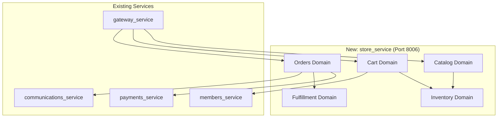
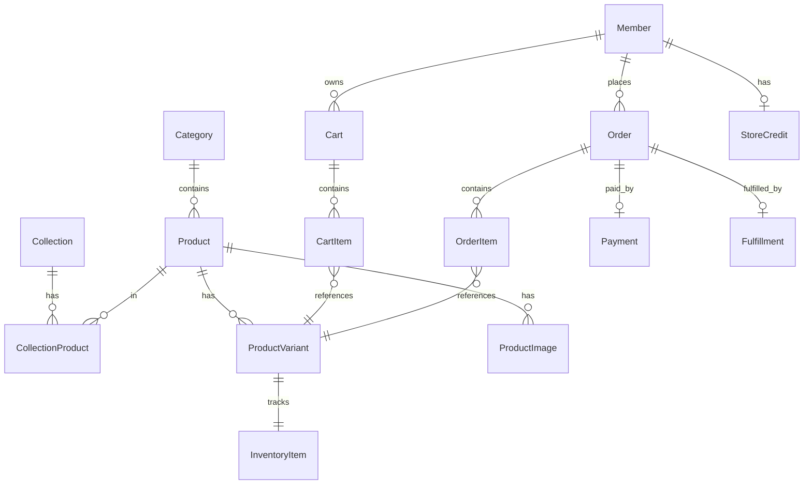
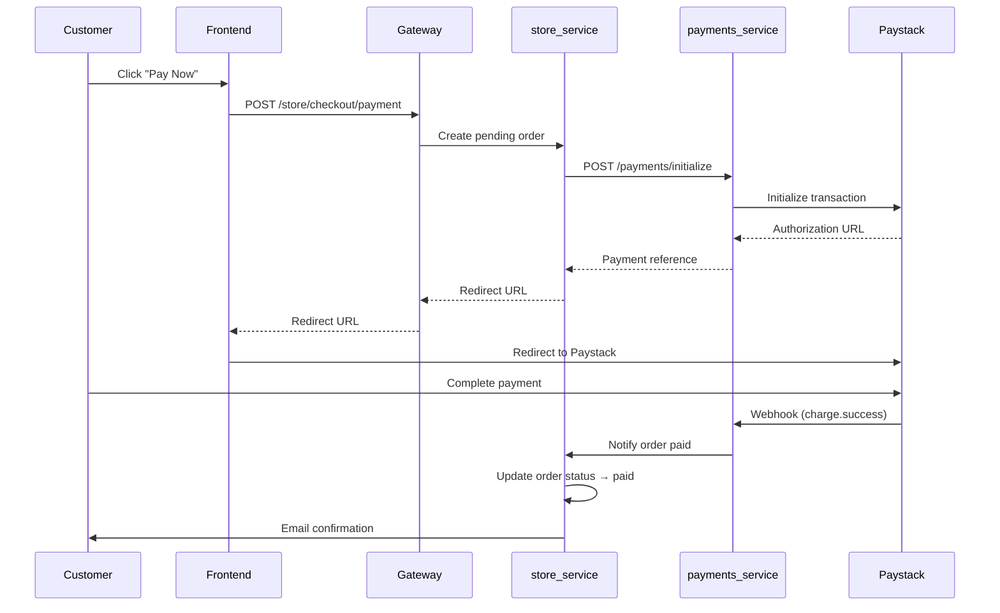
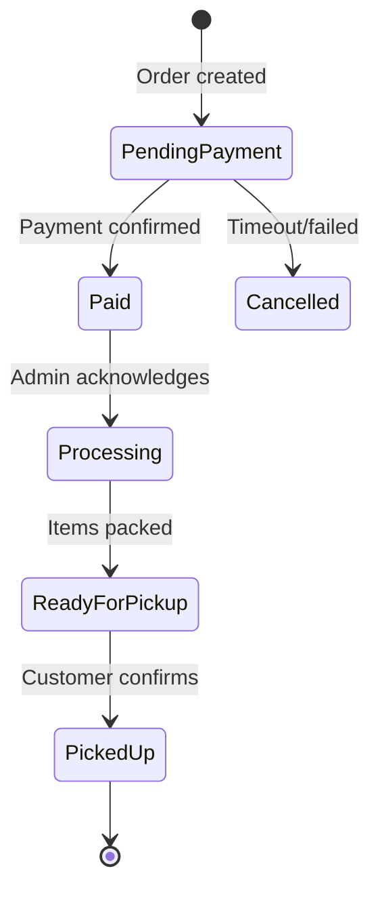
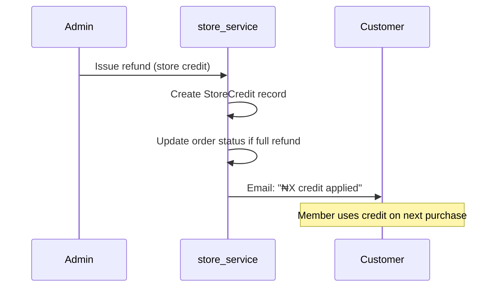

# SwimBuddz E-Commerce Module — Architecture & Implementation Plan

## Overview

This document outlines the architecture for adding an e-commerce capability (product store) to SwimBuddz. The store allows members and visitors to purchase swimming gear, with tiered member discounts, pool pickup fulfillment, and Paystack payments.

**Confirmed Scope:**
- **Sourcing**: Hybrid (stock common items, pre-order specialty)
- **Fulfillment**: Pool pickup default + home delivery (MVP)
- **Products**: Goggles, caps, kickboards, pull buoys, fins, accessories, swimwear (with sizing)
- **Pricing**: Public catalog, tiered member discounts (Community 5%, Club 10%, Academy 15%)
- **Returns**: All sales final; store credit for exceptions
- **Build**: Custom `store_service` microservice

> [!NOTE]
> **Implementation Status**: Phase 2 (Data Model + APIs) is complete. Core `store_service` scaffolding has been created.

---

## User Review Required

> [!IMPORTANT]
> **Swimwear Sizing Complexity**
> Swimwear with multiple sizes introduces variant management and increases return risk. I recommend:
> 1. Require size chart acknowledgment before checkout
> 2. Start with limited size range (S/M/L/XL only)
> 3. Allow "notify when available" for out-of-stock sizes

> [!WARNING]
> **Inventory Pre-Order Model**
> Pre-order items need clear UX: "Ships in 2-3 weeks" messaging, order status tracking, and potentially separate payment timing (pay now vs pay when ready). Confirm preference:
> - **Option A**: Pay upfront, ship when ready ← *Recommended for simplicity*
> - **Option B**: Pay deposit now, balance on shipment

---

## Phase 1: Architecture Blueprint

### Domain Boundaries



| Domain | Responsibility | Service |
|--------|---------------|---------|
| **Catalog** | Products, variants, categories, collections, pricing, images | `store_service` |
| **Inventory** | Stock levels, reservations, restock alerts, pre-order tracking | `store_service` |
| **Cart** | Cart lifecycle, line items, coupon application, member discounts | `store_service` |
| **Orders** | Order creation, status, history, cancellation | `store_service` |
| **Pricing** | Base prices, member tier discounts, coupons | `store_service` (reuse `Discount` from payments) |
| **Fulfillment** | Pickup scheduling, delivery tracking (Phase 2) | `store_service` |
| **Payments** | Payment initiation, Paystack webhooks, refunds | `payments_service` (existing) |
| **Members** | Member tier lookup for discounts | `members_service` (existing) |
| **Notifications** | Order confirmation, shipping updates | `communications_service` (existing) |

---

### Event Model

Events drive async operations (notifications, analytics, inventory sync). Published to a lightweight in-process event bus initially; can upgrade to Redis/RabbitMQ later.

| Event | Trigger | Subscribers |
|-------|---------|-------------|
| `ProductCreated` | Admin creates product | Analytics |
| `ProductUpdated` | Admin updates product/pricing | Cache invalidation |
| `InventoryReserved` | Cart checkout started | — |
| `InventoryReleased` | Cart abandoned/expired | — |
| `InventoryDepleted` | Stock hits 0 | Admin alert, hide from store |
| `OrderCreated` | Checkout completed | Email confirmation |
| `PaymentAuthorized` | Paystack webhook success | Order status → `paid` |
| `PaymentFailed` | Paystack webhook failure | Order status → `payment_failed`, notify customer |
| `OrderFulfilled` | Admin marks picked up/shipped | Email notification |
| `RefundIssued` | Admin issues store credit | Credit applied to member |
| `StoreCredit:Applied` | Credit used at checkout | Audit log |

---

### Audit Log Strategy

All sensitive operations are logged to `store_audit_logs` table:

| Category | Events Logged |
|----------|---------------|
| **Pricing** | Price changes, discount creation/modification |
| **Inventory** | Stock adjustments (manual), reservation overrides |
| **Orders** | Status changes, cancellations, manual edits |
| **Refunds** | Store credit issued, reason, admin who approved |
| **Admin** | Product publish/unpublish, category changes |

**Schema:**
```sql
store_audit_logs (
  id UUID PRIMARY KEY,
  entity_type VARCHAR(50),      -- 'product', 'order', 'inventory'
  entity_id UUID,
  action VARCHAR(50),           -- 'price_changed', 'stock_adjusted', etc.
  old_value JSONB,
  new_value JSONB,
  performed_by VARCHAR(255),    -- admin auth_id
  performed_at TIMESTAMPTZ,
  ip_address VARCHAR(45),
  notes TEXT
)
```

---

## Phase 2: Data Model

### Entity Relationship Diagram



---

### Database Schema

#### Catalog Tables

```sql
-- Categories (e.g., "Goggles", "Swimwear", "Training Aids")
categories (
  id UUID PRIMARY KEY DEFAULT gen_random_uuid(),
  name VARCHAR(100) NOT NULL,
  slug VARCHAR(100) UNIQUE NOT NULL,
  description TEXT,
  image_url VARCHAR(512),
  parent_id UUID REFERENCES categories(id),  -- for subcategories
  sort_order INT DEFAULT 0,
  is_active BOOLEAN DEFAULT true,
  created_at TIMESTAMPTZ DEFAULT now(),
  updated_at TIMESTAMPTZ DEFAULT now()
);

-- Products (e.g., "SwimBuddz Pro Goggles")
products (
  id UUID PRIMARY KEY DEFAULT gen_random_uuid(),
  category_id UUID REFERENCES categories(id),
  name VARCHAR(255) NOT NULL,
  slug VARCHAR(255) UNIQUE NOT NULL,
  description TEXT,
  short_description VARCHAR(500),
  
  -- Pricing (base, before discounts)
  base_price_ngn DECIMAL(12,2) NOT NULL,
  compare_at_price_ngn DECIMAL(12,2),  -- "was" price for sales
  
  -- Status
  status VARCHAR(20) DEFAULT 'draft',  -- draft, active, archived
  is_featured BOOLEAN DEFAULT false,
  
  -- SEO
  meta_title VARCHAR(255),
  meta_description VARCHAR(500),
  
  -- Variant config
  has_variants BOOLEAN DEFAULT false,
  variant_options JSONB,  -- e.g., {"Size": ["S","M","L"], "Color": ["Black","Blue"]}
  
  -- Sourcing
  sourcing_type VARCHAR(20) DEFAULT 'stocked',  -- stocked, preorder
  preorder_lead_days INT,  -- e.g., 21 for "ships in 3 weeks"
  
  created_at TIMESTAMPTZ DEFAULT now(),
  updated_at TIMESTAMPTZ DEFAULT now()
);

-- Product Variants (e.g., "SwimBuddz Pro Goggles - Blue - Adult")
product_variants (
  id UUID PRIMARY KEY DEFAULT gen_random_uuid(),
  product_id UUID REFERENCES products(id) ON DELETE CASCADE,
  sku VARCHAR(100) UNIQUE NOT NULL,
  name VARCHAR(255),  -- auto-generated from options
  
  -- Options (e.g., {"Size": "M", "Color": "Blue"})
  options JSONB NOT NULL DEFAULT '{}',
  
  -- Pricing override (null = use product base price)
  price_override_ngn DECIMAL(12,2),
  
  -- Physical attributes (for shipping calc later)
  weight_grams INT,
  
  -- Status
  is_active BOOLEAN DEFAULT true,
  
  created_at TIMESTAMPTZ DEFAULT now(),
  updated_at TIMESTAMPTZ DEFAULT now()
);

-- Product Images
product_images (
  id UUID PRIMARY KEY DEFAULT gen_random_uuid(),
  product_id UUID REFERENCES products(id) ON DELETE CASCADE,
  variant_id UUID REFERENCES product_variants(id) ON DELETE SET NULL,
  url VARCHAR(512) NOT NULL,
  alt_text VARCHAR(255),
  sort_order INT DEFAULT 0,
  is_primary BOOLEAN DEFAULT false,
  created_at TIMESTAMPTZ DEFAULT now()
);

-- Collections (curated groups like "New Arrivals", "Coach Favorites")
collections (
  id UUID PRIMARY KEY DEFAULT gen_random_uuid(),
  name VARCHAR(100) NOT NULL,
  slug VARCHAR(100) UNIQUE NOT NULL,
  description TEXT,
  image_url VARCHAR(512),
  is_active BOOLEAN DEFAULT true,
  sort_order INT DEFAULT 0,
  created_at TIMESTAMPTZ DEFAULT now(),
  updated_at TIMESTAMPTZ DEFAULT now()
);

-- Collection-Product junction
collection_products (
  collection_id UUID REFERENCES collections(id) ON DELETE CASCADE,
  product_id UUID REFERENCES products(id) ON DELETE CASCADE,
  sort_order INT DEFAULT 0,
  PRIMARY KEY (collection_id, product_id)
);
```

#### Inventory Tables

```sql
-- Inventory tracking per variant
inventory_items (
  id UUID PRIMARY KEY DEFAULT gen_random_uuid(),
  variant_id UUID UNIQUE REFERENCES product_variants(id) ON DELETE CASCADE,
  
  -- Stock levels
  quantity_on_hand INT NOT NULL DEFAULT 0,
  quantity_reserved INT NOT NULL DEFAULT 0,  -- held in active carts
  quantity_available INT GENERATED ALWAYS AS (quantity_on_hand - quantity_reserved) STORED,
  
  -- Thresholds
  low_stock_threshold INT DEFAULT 5,
  
  -- Tracking
  last_restock_at TIMESTAMPTZ,
  last_sold_at TIMESTAMPTZ,
  
  created_at TIMESTAMPTZ DEFAULT now(),
  updated_at TIMESTAMPTZ DEFAULT now(),
  
  CONSTRAINT positive_stock CHECK (quantity_on_hand >= 0),
  CONSTRAINT valid_reserved CHECK (quantity_reserved >= 0 AND quantity_reserved <= quantity_on_hand)
);

-- Inventory movements (audit trail)
inventory_movements (
  id UUID PRIMARY KEY DEFAULT gen_random_uuid(),
  inventory_item_id UUID REFERENCES inventory_items(id),
  movement_type VARCHAR(30) NOT NULL,  -- restock, sale, reservation, release, adjustment
  quantity INT NOT NULL,  -- positive = add, negative = subtract
  reference_type VARCHAR(30),  -- order, cart, manual
  reference_id UUID,
  notes TEXT,
  performed_by VARCHAR(255),
  created_at TIMESTAMPTZ DEFAULT now()
);
```

#### Cart Tables

```sql
-- Shopping carts
carts (
  id UUID PRIMARY KEY DEFAULT gen_random_uuid(),
  
  -- Owner (null for guest carts, use session_id)
  member_auth_id VARCHAR(255),
  session_id VARCHAR(255),  -- for guest carts
  
  -- Applied discounts
  discount_code VARCHAR(50),
  member_discount_percent DECIMAL(5,2),  -- calculated from tier
  
  -- Status
  status VARCHAR(20) DEFAULT 'active',  -- active, converted, abandoned
  
  -- Expiry (for inventory reservation release)
  expires_at TIMESTAMPTZ,
  
  created_at TIMESTAMPTZ DEFAULT now(),
  updated_at TIMESTAMPTZ DEFAULT now(),
  
  CONSTRAINT one_owner CHECK (member_auth_id IS NOT NULL OR session_id IS NOT NULL)
);

-- Cart line items
cart_items (
  id UUID PRIMARY KEY DEFAULT gen_random_uuid(),
  cart_id UUID REFERENCES carts(id) ON DELETE CASCADE,
  variant_id UUID REFERENCES product_variants(id),
  quantity INT NOT NULL DEFAULT 1,
  
  -- Snapshot price at add time (for comparison if price changes)
  unit_price_ngn DECIMAL(12,2) NOT NULL,
  
  created_at TIMESTAMPTZ DEFAULT now(),
  updated_at TIMESTAMPTZ DEFAULT now(),
  
  UNIQUE (cart_id, variant_id),
  CONSTRAINT positive_quantity CHECK (quantity > 0)
);
```

#### Order Tables

```sql
-- Orders
orders (
  id UUID PRIMARY KEY DEFAULT gen_random_uuid(),
  order_number VARCHAR(20) UNIQUE NOT NULL,  -- e.g., "SB-20260104-001"
  
  -- Customer
  member_auth_id VARCHAR(255),
  customer_email VARCHAR(255) NOT NULL,
  customer_name VARCHAR(255) NOT NULL,
  customer_phone VARCHAR(50),
  
  -- Pricing
  subtotal_ngn DECIMAL(12,2) NOT NULL,
  discount_amount_ngn DECIMAL(12,2) DEFAULT 0,
  store_credit_applied_ngn DECIMAL(12,2) DEFAULT 0,
  delivery_fee_ngn DECIMAL(12,2) DEFAULT 0,
  total_ngn DECIMAL(12,2) NOT NULL,
  
  -- Discounts applied
  discount_code VARCHAR(50),
  discount_breakdown JSONB,  -- {"code": "SWIM10", "member_tier": "club", "total_saved": 2500}
  
  -- Status
  status VARCHAR(30) DEFAULT 'pending_payment',
  -- pending_payment, paid, processing, ready_for_pickup, picked_up, shipped, delivered, cancelled, refunded
  
  -- Fulfillment
  fulfillment_type VARCHAR(20) DEFAULT 'pickup',  -- pickup, delivery
  pickup_location VARCHAR(100),  -- e.g., "Yaba Pool", "Federal Palace"
  pickup_session_id UUID,  -- optional: link to specific session for pickup
  
  -- Delivery (Phase 2)
  delivery_address JSONB,
  delivery_notes TEXT,
  
  -- Notes
  customer_notes TEXT,
  admin_notes TEXT,
  
  -- Timestamps
  paid_at TIMESTAMPTZ,
  fulfilled_at TIMESTAMPTZ,
  cancelled_at TIMESTAMPTZ,
  created_at TIMESTAMPTZ DEFAULT now(),
  updated_at TIMESTAMPTZ DEFAULT now()
);

-- Order line items
order_items (
  id UUID PRIMARY KEY DEFAULT gen_random_uuid(),
  order_id UUID REFERENCES orders(id) ON DELETE CASCADE,
  variant_id UUID REFERENCES product_variants(id),
  
  -- Snapshot at order time (products may change)
  product_name VARCHAR(255) NOT NULL,
  variant_name VARCHAR(255),
  sku VARCHAR(100),
  
  quantity INT NOT NULL,
  unit_price_ngn DECIMAL(12,2) NOT NULL,
  line_total_ngn DECIMAL(12,2) NOT NULL,
  
  -- For pre-order items
  is_preorder BOOLEAN DEFAULT false,
  estimated_ship_date DATE,
  
  created_at TIMESTAMPTZ DEFAULT now()
);

-- Store credits (for returns/exceptions)
store_credits (
  id UUID PRIMARY KEY DEFAULT gen_random_uuid(),
  member_auth_id VARCHAR(255) NOT NULL,
  
  amount_ngn DECIMAL(12,2) NOT NULL,
  balance_ngn DECIMAL(12,2) NOT NULL,
  
  -- Source
  source_type VARCHAR(30) NOT NULL,  -- return, goodwill, promotion
  source_order_id UUID REFERENCES orders(id),
  reason TEXT,
  
  expires_at TIMESTAMPTZ,  -- optional expiry
  
  issued_by VARCHAR(255),  -- admin auth_id
  created_at TIMESTAMPTZ DEFAULT now()
);

-- Store credit usage log
store_credit_transactions (
  id UUID PRIMARY KEY DEFAULT gen_random_uuid(),
  store_credit_id UUID REFERENCES store_credits(id),
  order_id UUID REFERENCES orders(id),
  amount_ngn DECIMAL(12,2) NOT NULL,
  created_at TIMESTAMPTZ DEFAULT now()
);
```

---

## Phase 2: API Endpoints

### Public Endpoints (No Auth)

| Method | Endpoint | Description |
|--------|----------|-------------|
| GET | `/api/v1/store/categories` | List active categories |
| GET | `/api/v1/store/categories/{slug}` | Category detail with products |
| GET | `/api/v1/store/collections` | List active collections |
| GET | `/api/v1/store/collections/{slug}` | Collection detail with products |
| GET | `/api/v1/store/products` | Browse/search products (paginated, filterable) |
| GET | `/api/v1/store/products/{slug}` | Product detail with variants, images |

### Cart Endpoints (Guest or Authenticated)

| Method | Endpoint | Description |
|--------|----------|-------------|
| POST | `/api/v1/store/cart` | Create cart (returns cart_id, session token for guests) |
| GET | `/api/v1/store/cart` | Get current cart (by session or auth) |
| POST | `/api/v1/store/cart/items` | Add item to cart |
| PATCH | `/api/v1/store/cart/items/{id}` | Update quantity |
| DELETE | `/api/v1/store/cart/items/{id}` | Remove item |
| POST | `/api/v1/store/cart/discount` | Apply discount code |
| DELETE | `/api/v1/store/cart/discount` | Remove discount code |

### Checkout Endpoints (Authenticated)

| Method | Endpoint | Description |
|--------|----------|-------------|
| POST | `/api/v1/store/checkout/start` | Validate cart, reserve inventory, create pending order |
| POST | `/api/v1/store/checkout/payment` | Initialize Paystack payment (returns payment URL) |
| GET | `/api/v1/store/checkout/verify/{reference}` | Verify payment status |

### Order Endpoints (Authenticated)

| Method | Endpoint | Description |
|--------|----------|-------------|
| GET | `/api/v1/store/orders` | List member's orders |
| GET | `/api/v1/store/orders/{order_number}` | Order detail |

### Webhook Endpoint

| Method | Endpoint | Description |
|--------|----------|-------------|
| POST | `/api/v1/store/webhooks/paystack` | Paystack payment webhook |

### Admin Endpoints (Role: admin)

| Method | Endpoint | Description |
|--------|----------|-------------|
| **Categories** | | |
| POST | `/api/v1/admin/store/categories` | Create category |
| PATCH | `/api/v1/admin/store/categories/{id}` | Update category |
| DELETE | `/api/v1/admin/store/categories/{id}` | Archive category |
| **Products** | | |
| GET | `/api/v1/admin/store/products` | List all products (inc. draft) |
| POST | `/api/v1/admin/store/products` | Create product |
| PATCH | `/api/v1/admin/store/products/{id}` | Update product |
| POST | `/api/v1/admin/store/products/{id}/variants` | Add variant |
| PATCH | `/api/v1/admin/store/products/{id}/variants/{vid}` | Update variant |
| POST | `/api/v1/admin/store/products/{id}/images` | Upload image |
| **Inventory** | | |
| GET | `/api/v1/admin/store/inventory` | Inventory dashboard |
| PATCH | `/api/v1/admin/store/inventory/{id}` | Adjust stock |
| GET | `/api/v1/admin/store/inventory/low-stock` | Low stock alerts |
| **Orders** | | |
| GET | `/api/v1/admin/store/orders` | List all orders (filterable) |
| GET | `/api/v1/admin/store/orders/{id}` | Order detail |
| PATCH | `/api/v1/admin/store/orders/{id}/status` | Update order status |
| POST | `/api/v1/admin/store/orders/{id}/refund` | Issue store credit refund |
| **Store Credits** | | |
| GET | `/api/v1/admin/store/credits` | List all credits |
| POST | `/api/v1/admin/store/credits` | Issue manual credit |
| **Reports** | | |
| GET | `/api/v1/admin/store/reports/sales` | Sales summary |
| GET | `/api/v1/admin/store/reports/inventory` | Inventory report |

---

## RLS (Row-Level Security) Policies

Since you're using Supabase, here are the RLS policies for key tables:

| Table | Policy | Rule |
|-------|--------|------|
| `products` | `SELECT` public | `status = 'active'` |
| `products` | `ALL` admin | `auth.jwt() ->> 'role' = 'admin'` |
| `carts` | `SELECT/UPDATE` own | `member_auth_id = auth.uid() OR session_id = request.headers->>'x-session-id'` |
| `orders` | `SELECT` own | `member_auth_id = auth.uid()` |
| `orders` | `ALL` admin | `auth.jwt() ->> 'role' = 'admin'` |
| `store_credits` | `SELECT` own | `member_auth_id = auth.uid()` |
| `inventory_*` | `ALL` admin only | No public access |

---

## Phase 3: Frontend UX

### Store Pages

| Page | Route | Description |
|------|-------|-------------|
| Store Home | `/store` | Featured products, categories, collections |
| Category | `/store/category/{slug}` | Products in category, filters |
| Collection | `/store/collection/{slug}` | Curated product list |
| Product Detail | `/store/product/{slug}` | Images, description, variants, add to cart |
| Cart | `/store/cart` | Line items, totals, discount code input |
| Checkout | `/store/checkout` | Single-page: pickup location, review, pay |
| Order Confirmation | `/store/orders/{number}/confirmation` | Thank you, next steps |
| Order History | `/account/orders` | Past orders with status |
| Order Detail | `/account/orders/{number}` | Full order detail |

### Admin Pages

| Page | Route | Description |
|------|-------|-------------|
| Store Dashboard | `/admin/store` | Quick stats, recent orders, low stock |
| Products | `/admin/store/products` | List, search, filter |
| Product Edit | `/admin/store/products/{id}` | Full product editor with variants |
| Categories | `/admin/store/categories` | Category tree editor |
| Inventory | `/admin/store/inventory` | Stock levels, bulk adjust |
| Orders | `/admin/store/orders` | Order queue, status updates |
| Order Detail | `/admin/store/orders/{id}` | Order detail, fulfill, refund |
| Store Credits | `/admin/store/credits` | Credit issuance log |

### UX Trade-offs

| Decision | Choice | Rationale |
|----------|--------|-----------|
| Checkout flow | **Single-page** | Fewer abandonment points; pool pickup keeps it simple |
| Guest checkout | **Require login** | Need member tier for discounts; encourages registration |
| Size selection | **In-page variant picker** | Swimwear sizes visible without extra clicks |
| Pre-order UX | **Clear badge + ETA** | "Pre-order · Ships in 3 weeks" prominently displayed |

---

## Phase 4: Payments + Fulfillment

### Paystack Integration

Reuse existing `payments_service` pattern:



**Key Paystack Considerations:**
- Use `PaymentPurpose.STORE_ORDER` (new enum value)
- Store `order_id` in payment metadata for reconciliation
- Webhook idempotency: check if order already marked paid
- Failed payment: order status → `payment_failed`, release inventory

### Shipping / Pickup Workflow

**MVP: Pool Pickup Only**



**Pickup Locations:**
- Yaba Pool
- Federal Palace
- Sunfit (if applicable)
- Optionally: specific session (e.g., "Pick up at Saturday Yaba session")

**Operational Playbook:**
1. **Order comes in** → Admin sees in `/admin/store/orders`
2. **Admin packs items** → Marks "Ready for Pickup"
3. **Customer gets SMS/Email** → "Your order is ready at Yaba Pool"
4. **At pickup** → Customer shows order number, admin marks "Picked Up"

### Refund Workflow



---

## Phase 5: Build Plan + Risk Register

### Implementation Order

| Phase | Tasks | Est. Time | Dependencies |
|-------|-------|-----------|--------------|
| **5.1** | Database schema + migrations | 2 days | None |
| **5.2** | Catalog API (products, categories, variants) | 3 days | 5.1 |
| **5.3** | Admin product management UI | 3 days | 5.2 |
| **5.4** | Inventory tracking | 2 days | 5.2 |
| **5.5** | Cart API | 2 days | 5.2, 5.4 |
| **5.6** | Checkout + Paystack integration | 3 days | 5.5, payments_service |
| **5.7** | Order management API | 2 days | 5.6 |
| **5.8** | Store frontend (browse, cart, checkout) | 4 days | 5.5, 5.6 |
| **5.9** | Admin order management UI | 2 days | 5.7 |
| **5.10** | Store credits + refund flow | 2 days | 5.7 |
| **5.11** | Email notifications | 1 day | 5.7 |
| **5.12** | Testing + polish | 3 days | All |

**Total: ~4-5 weeks**

### Integration Points with Existing Modules

| Integration | How |
|-------------|-----|
| `members_service` | Lookup member tier for discount calculation |
| `payments_service` | Reuse Paystack init/webhook, add `STORE_ORDER` purpose |
| `communications_service` | Trigger order confirmation/ready emails |
| `gateway_service` | New proxy routes for `/store/*` |
| `Supabase Auth` | Member auth_id for cart/order ownership |

### Risk Register

| Risk | Likelihood | Impact | Mitigation |
|------|------------|--------|------------|
| **Inventory mismatch** | Medium | High | Reservation system with TTL; nightly reconciliation job |
| **Paystack webhook failure** | Low | High | Idempotent handlers; manual verification endpoint; reconciliation script |
| **Double payment** | Low | High | Unique order reference; check order status before processing |
| **Swimwear size returns** | Medium | Medium | Size chart acknowledgment; store credit only policy |
| **Abandoned carts holding stock** | Medium | Low | 30-min reservation TTL; cron job to release |
| **Pre-order fulfillment delays** | Medium | Medium | Clear ETAs in UI; admin tools to update ETAs; proactive comms |
| **Fraud (stolen cards)** | Low | Medium | Paystack handles 3DS; require pickup (no shipping = lower fraud) |
| **Admin error (wrong stock)** | Medium | Low | Audit log all changes; require confirmation for bulk updates |
| **Data privacy (customer info)** | Low | High | RLS policies; encrypt PII at rest; minimal data retention |

---

## Verification Plan

### Automated Tests
- Unit tests: Cart calculations, discount application, inventory reservation
- Integration tests: Full checkout flow with mock Paystack
- Webhook replay: Test idempotency with duplicate webhook calls

### Manual Verification
- End-to-end purchase flow in staging
- Admin product creation and inventory adjustment
- Verify RLS policies block unauthorized access
- Test guest-to-member cart merge

---

## Appendix: New Payment Purpose

Add to `payments_service/models.py`:

```python
class PaymentPurpose(str, enum.Enum):
    # ... existing
    STORE_ORDER = "store_order"  # E-commerce order payment
```

---

## Current Implementation Status

### ✅ Completed (Phase 2)

| File | Size | Description |
|------|------|-------------|
| [models.py](file:///Users/i/Documents/work/swimbuddz/swimbuddz-backend/services/store_service/models.py) | 31KB | 16 entities: Category, Product, ProductVariant, ProductImage, Collection, InventoryItem, Cart, CartItem, Order, OrderItem, PickupLocation, StoreCredit, StoreAuditLog |
| [schemas.py](file:///Users/i/Documents/work/swimbuddz/swimbuddz-backend/services/store_service/schemas.py) | 14KB | 50+ Pydantic request/response models |
| [router.py](file:///Users/i/Documents/work/swimbuddz/swimbuddz-backend/services/store_service/router.py) | 28KB | Public endpoints: catalog, cart, checkout, orders, store credits |
| [admin_router.py](file:///Users/i/Documents/work/swimbuddz/swimbuddz-backend/services/store_service/admin_router.py) | 33KB | Admin CRUD with full audit logging |
| [app/main.py](file:///Users/i/Documents/work/swimbuddz/swimbuddz-backend/services/store_service/app/main.py) | 1KB | FastAPI app setup |
| [docker-compose.yml](file:///Users/i/Documents/work/swimbuddz/swimbuddz-backend/docker-compose.yml) | Updated | store-service on port 8010 |

### 🔲 Next Steps

1. **Run initial migration**:
   ```bash
   docker compose up -d store-service
   docker compose exec store-service alembic revision --autogenerate -m "initial_store_schema"
   docker compose exec store-service alembic upgrade head
   ```

2. **Add gateway proxy routes** for `/store/*` and `/admin/store/*`

3. **Implement Paystack webhook handler** for store orders

4. **Seed initial pickup locations** (Yaba Pool, Federal Palace, Sunfit)

5. **Frontend implementation** (Phase 3)
