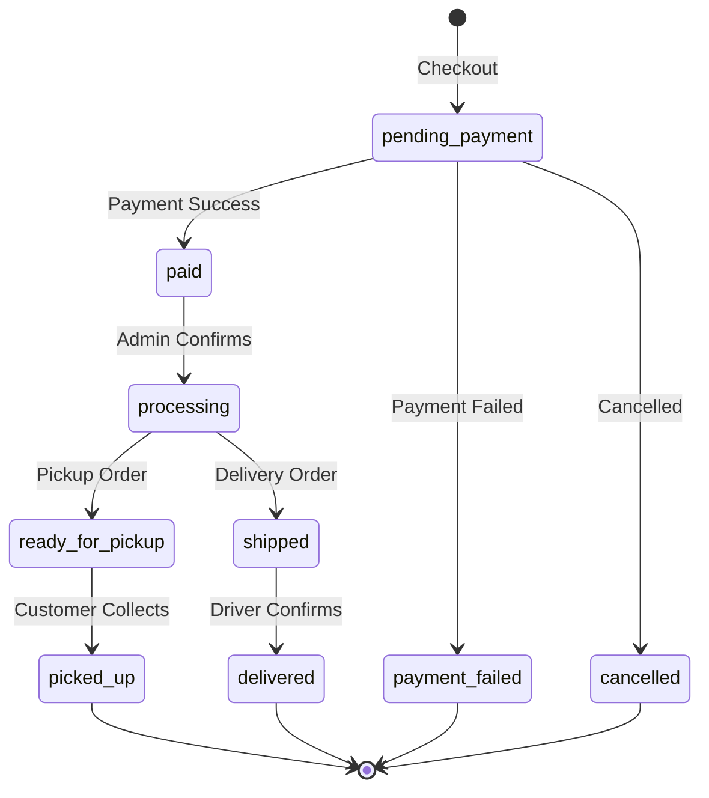

# SwimBuddz Store - Operational Playbook

## Overview

This document covers day-to-day operations for the SwimBuddz e-commerce store, including order management, inventory, and fulfillment workflows.

---

## Quick Reference URLs

| Environment | Store URL | Admin URL |
|-------------|-----------|-----------|
| Local | http://localhost:3000/store | http://localhost:3000/admin/store |
| Staging | TBD | TBD |
| Production | TBD | TBD |

---

## Order Lifecycle

### Status Descriptions

| Status | Description | Next Actions |
|--------|-------------|--------------|
| `pending_payment` | Order created, awaiting Paystack payment | Customer pays via Paystack |
| `paid` | Payment confirmed via webhook | Admin moves to `processing` |
| `processing` | Admin is preparing the order | Assign to fulfillment |
| `ready_for_pickup` | Ready at pickup location | Notify customer |
| `shipped` | Out for delivery | Add tracking number |
| `picked_up` | Customer collected at location | Done |
| `delivered` | Delivered to customer address | Done |
| `cancelled` | Order cancelled (before ship) | Refund if needed |
| `refunded` | Full refund issued | Done |

---

## Daily Operations Checklist

### Morning (Opening)
- [ ] Check new orders in admin panel (`/admin/store/orders`)
- [ ] Review any `paid` orders that need to move to `processing`
- [ ] Check inventory for low-stock alerts

### Throughout Day
- [ ] Process orders: mark as `ready_for_pickup` or `shipped`
- [ ] Update tracking numbers for delivery orders
- [ ] Respond to customer inquiries

### Evening (Closing)
- [ ] Reconcile pickup orders collected today
- [ ] Update delivery statuses

---

## Admin Panel Quick Guide

### Viewing Orders
1. Navigate to **Admin → Store → Orders**
2. Use filters: All, Pending, Paid, Processing, etc.
3. Click order number to view details

### Updating Order Status
1. Open order detail page
2. Use "Quick Actions" buttons or dropdown
3. Add admin notes if needed
4. System logs all changes for audit

### Adding Tracking Number (Delivery Orders)
1. Open order detail
2. Enter tracking number in "Fulfillment" section
3. Mark as `shipped`
4. Customer receives notification

---

## Inventory Management

### Low Stock Alerts
- System alerts when quantity drops below threshold (default: 3)
- View low stock items: **Admin → Store → Inventory → Low Stock**

### Restocking
1. Go to **Admin → Store → Inventory**
2. Find the variant to restock
3. Click "Adjust" and enter quantity
4. Add notes for record keeping

### Stock Movements Tracked Automatically
- `reservation`: Customer checkout reserves stock
- `sale`: Order completed
- `restock`: Admin adds inventory
- `adjustment`: Manual correction

---

## Refund Policy

**All sales are final.** However, for exceptional cases:

1. Issue **Store Credit** (not cash refund)
2. Go to order detail → Refund button
3. Enter amount (max = order total)
4. Credits applied to customer's account
5. Customer can use on next purchase

---

## Pickup Locations

| Location | Address | Hours |
|----------|---------|-------|
| Rowe Park Pool | Rowe Park, Yaba, Lagos | Tue-Sun 6am-8pm |
| Lekki Swimming Center | 123 Admiralty Way, Lekki Phase 1 | Mon-Sun 7am-7pm |
| VI Sports Complex | Victoria Island, Lagos | Mon-Sat 8am-6pm |

### Pickup Process
1. Customer shows order number at reception
2. Staff verifies identity (email or phone)
3. Staff marks order as `picked_up` in admin
4. Customer signs acknowledgment

---

## Delivery Process

1. Delivery fee: ₦2,000 flat rate
2. Driver assigned when order `processing`
3. Update status to `shipped` with tracking
4. Driver confirms delivery → `delivered`

---

## Payment Integration

### Paystack Flow
1. Customer completes checkout → Order created (PENDING_PAYMENT)
2. Frontend calls payments API → Paystack checkout URL
3. Customer pays on Paystack
4. Webhook received → Order marked PAID
5. Admin notified of new paid order

### Manual Verification (Fallback)
If webhook delayed, customer can trigger verification from billing page.

---

## Troubleshooting

### Order stuck on "pending_payment"
- Customer may not have completed Paystack payment
- Check Paystack dashboard for transaction status
- If paid in Paystack but not reflected, check webhook logs

### Inventory mismatch
- Check inventory movements log
- Look for failed reservations
- Manual adjustment may be needed with notes

### Customer can't find order
- Search by order number or email in admin
- Verify customer email matches order

---

## Emergency Contacts

| Role | Contact |
|------|---------|
| Product Issues | [Store Manager TBD] |
| Technical Issues | [Dev Team TBD] |
| Paystack Support | [Paystack Dashboard] |

---

## API Endpoints Reference

### Public (Store Frontend)
- `GET /api/v1/store/products` - List products
- `GET /api/v1/store/products/{slug}` - Product detail
- `GET /api/v1/store/cart` - Get cart
- `POST /api/v1/store/cart/items` - Add to cart
- `POST /api/v1/store/checkout/start` - Start checkout

### Admin
- `GET /api/v1/store/admin/orders` - List all orders
- `PATCH /api/v1/store/admin/orders/{id}/status` - Update status
- `POST /api/v1/store/admin/products` - Create product
- `PATCH /api/v1/store/admin/inventory/{id}` - Adjust stock

---

*Last updated: January 2026*
